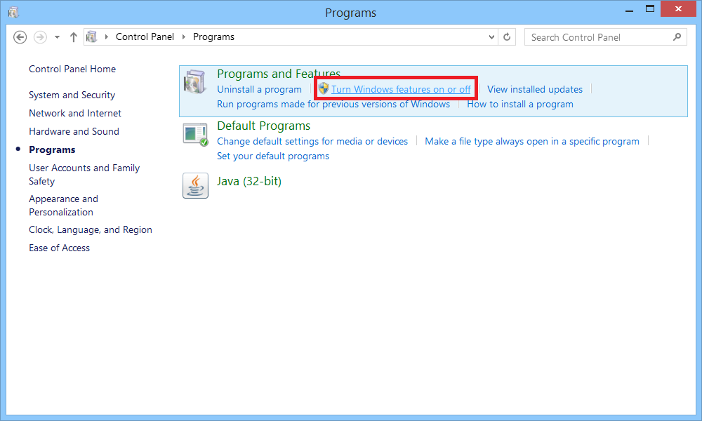
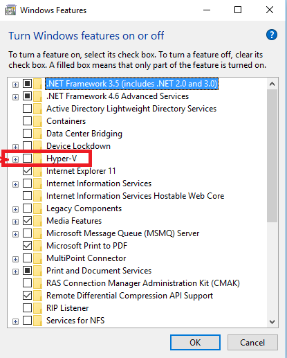
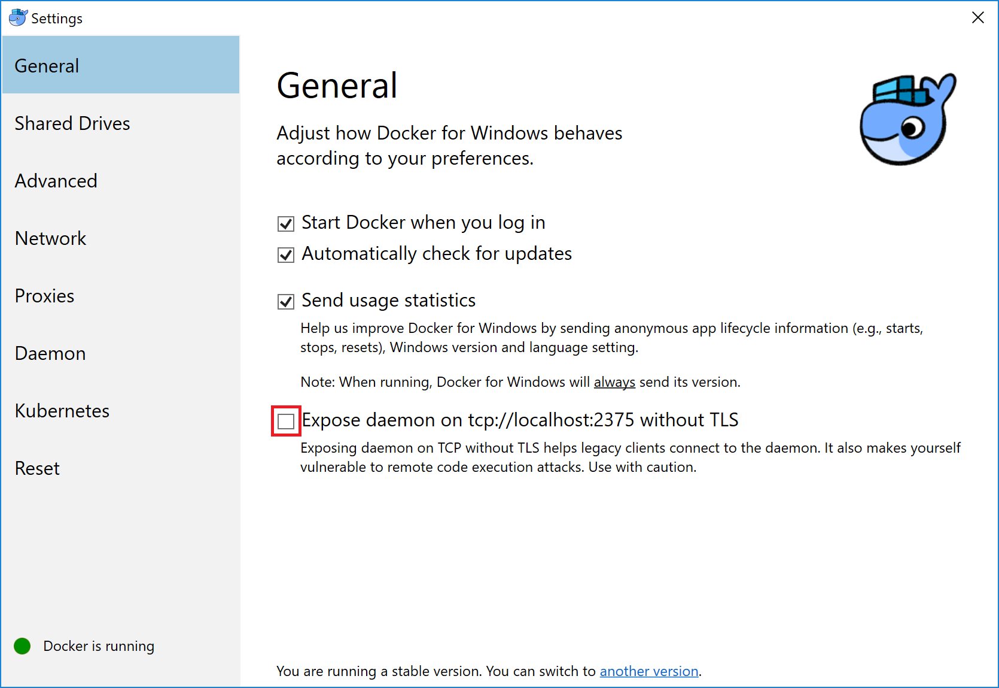
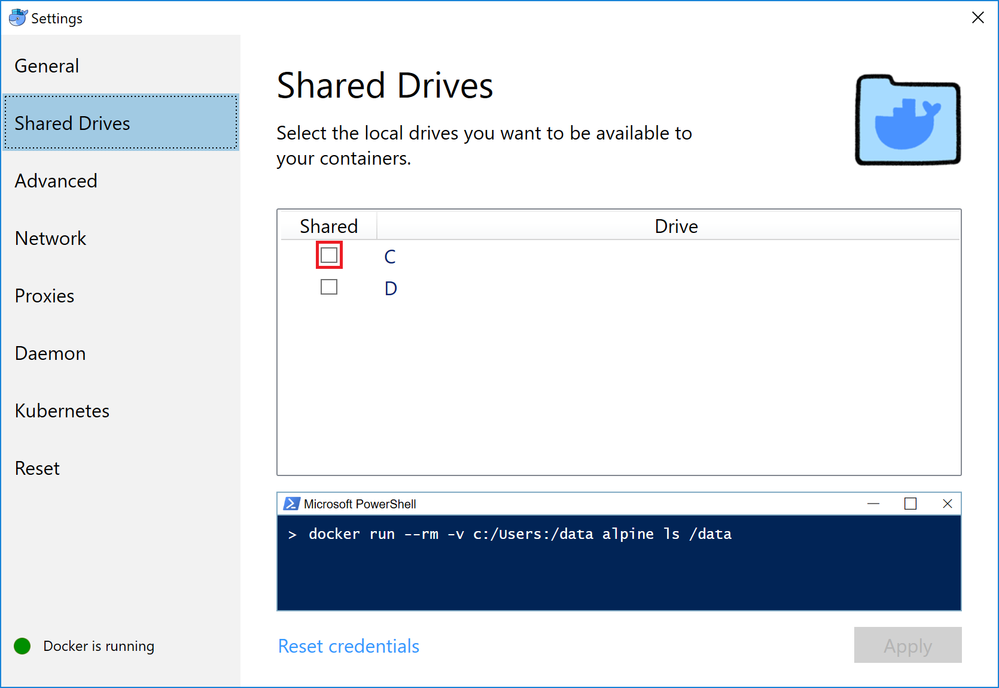

# Cài đặt Docker CE

## Trước khi cài đặt Docker

Docker yêu cầu Microsoft Hyper-V để chạy được trên môi trường Windows. Vì thế, bạn cần bật Hyper-V trước khi cài đặt Docker, yêu cầu này có thể cần khởi động lại máy tính của bạn. Sau khi bật Hyper-V, một số phần mềm yêu cầu tắt Hyper-V có thể tạm thời không hoạt động được như **VirtualBox, VM Ware, Techlog...**

### Yêu cầu hệ thống:

* Windows 10 64bit: Pro, Enterprise or Education \(Build 15063 or later\).
* Đã bật Microsoft Hyper-V
* Ram tối thiểu 4GB

## Hướng dẫn bật/tắt Hyper-V

* Đi đến **Control Panel → Programs → Turn Windows features on or off** 

* Click checkbox để bật/tắt **Hyper-V settings**, và nhấn OK.

## Cài đặt Docker

Double-click **Docker Desktop for Windows Installer.exe** để cài đặt. Nếu bạn chưa có bạn cài, vui lòng download [tại đây](https://download.docker.com/win/stable/Docker%20for%20Windows%20Installer.exe).

Làm theo hướng dẫn cài đặt của Docker, bạn sẽ được yêu cầu phân quyền truy cập của Docker App bằng tài khoản của hệ thống.

Click **Finish** để hoàn tất cài đặt và chạy Docker.

## Cấu hình cài đặt trước khi cài đặt I2G Local

* Right-Clicking Docker icon ở góc phải màn hình để Mở **Docker Menu**

* Chọn **Setting** để mở bảng cài đặt Docker

* Chọn tab **General,** Click checkbox **Expose daemon on tcp://localhost:2370 with TLS**

* Chọn tab **Shared Drives,** Click checkbox C để chia sẻ quyền cho Docker App. 

**Note:** Phần cài đặt này yêu cầu tài khoản hệ thống có mật khẩu. Nếu tài khoản hệ thống của bạn chưa có mật khẩu, vui lòng cài đặt mật khẩu cho tài khoản trước khi đến phần cài đặt này.

Cuối cùng, khởi động lại Docker Desktop.

