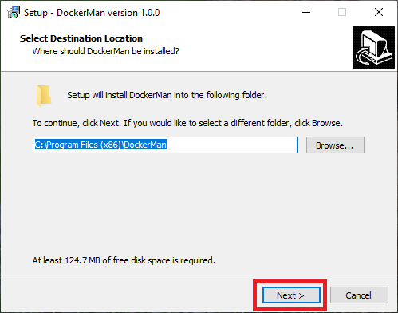
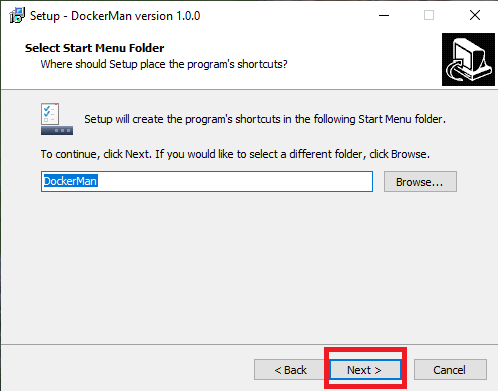
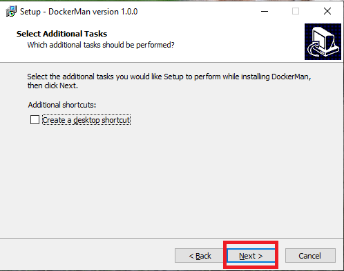
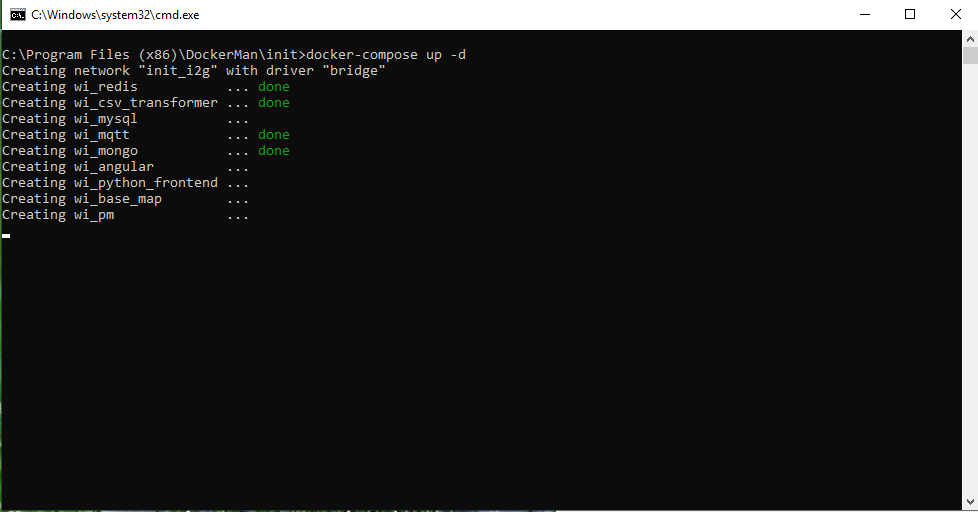
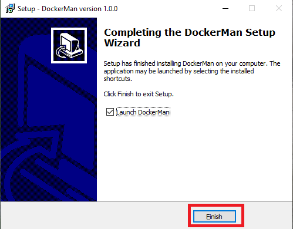
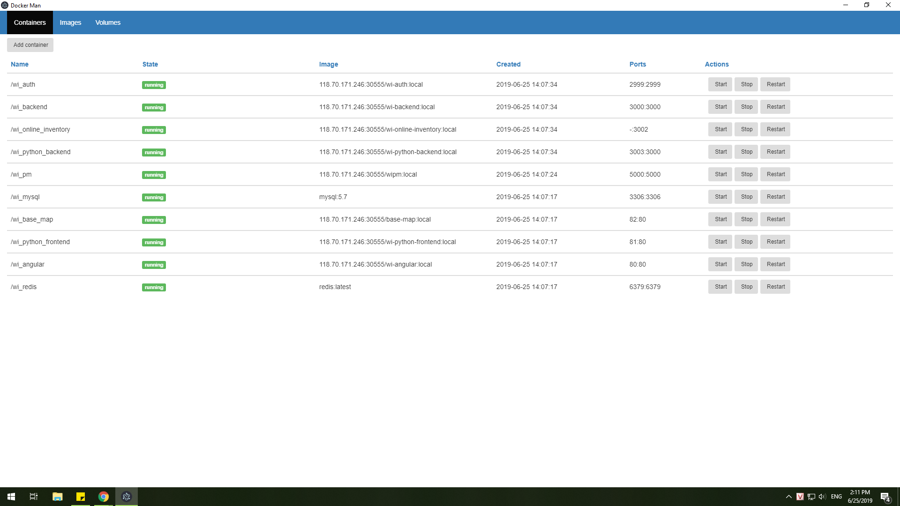
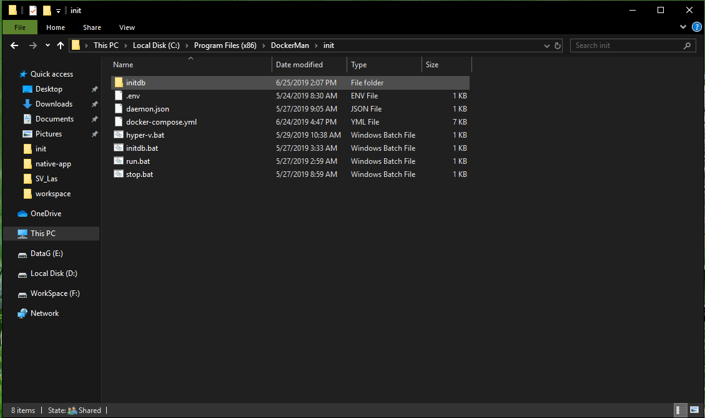
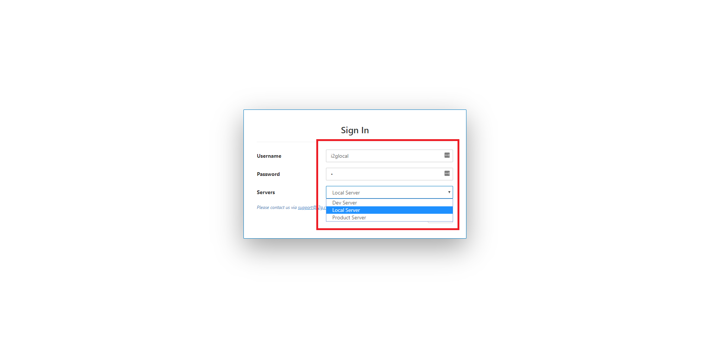
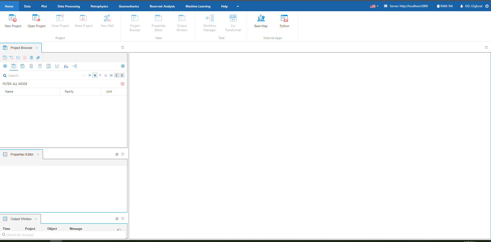

# Cài đặt I2G Local

## Tải file cài đặt

Nếu bạn chưa có file cài đặt I2G Local, vui lòng tải xuống [tại đây](https://drive.google.com/file/d/1TArIz1CLvZJ1MMGLuipX-T9GvJajw-52/view?usp=sharing). Vui lòng tải bản cập nhật mới nhất để có được tất cả tính năng mới nhất của I2G.

## Cài đặt

* Double Click **Docker Man.exe** để cài đặt chương trình. Chọn và làm theo hướng dẫn cài đặt dưới đây

* Một cửa sổ tải tài nguyên sẽ hiện ra, quá trình tải xuống có thể mất từ 10-15 phút, vui lòng chờ tải xuống hoàn tất.

* Sau khi tải xuống hoàn tất, **Finish** để chạy chương trình quản lý I2G Local.

## Quản lý I2G Local

Sau khi chạy I2G Local, sẽ mất từ 5-10 phút để toàn bộ hệ thống Running toàn bộ.

Khởi tạo tài khoản I2G Local, truy cập **C:\Program Files \(x86\)\DockerMan\init**

Click **initdb.bat** để tạo tài khoản I2G Local, sau khi chạy xong, thông tin tài khoản phía dưới đã được tạo.

`Tài khoản I2G Local:    
username: i2glocal    
password: 1`

Mở trình duyệt Google Chrome/Firefox, truy cập [http://localhost](http://localhost) để vào ứng dụng. Sử dụng tài khoản phía trên để đăng nhập. Sẽ mất khoảng 5-10 phút để khởi tạo dữ liệu ban đầu.

Sau khi đăng nhập thành công, bạn sẽ sử dụng mọi tính năng như trên I2G Cloud

